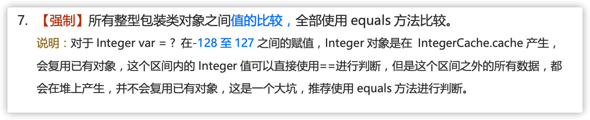

## 基本数据类型

##### 包装类型的缓存机制了解么？

java基本数据类型的包装类型的大部分都用到了缓存机制来提升性能。

`byte`,`short`,`integer`,`long` 这4种包装类默认创建了数值[-128,127]的相应类型的缓存数据，Character 创建了数值在[0,127]范围的缓存数据，boolean直接返回true or false。

integer 缓存源码：

```
public static Integer valueOf(int i) {
    if (i >= IntegerCache.low && i <= IntegerCache.high)
        return IntegerCache.cache[i + (-IntegerCache.low)];
    return new Integer(i);
}
private static class IntegerCache {
    static final int low = -128;
    static final int high;
    static {
        // high value may be configured by property
        int h = 127;
    }
}
```

Character 缓存源码：

```
public static Character valueOf(char c) {
    if (c <= 127) { // must cache
      return CharacterCache.cache[(int)c];
    }
    return new Character(c);
}

private static class CharacterCache {
    private CharacterCache(){}
    static final Character cache[] = new Character[127 + 1];
    static {
        for (int i = 0; i < cache.length; i++)
            cache[i] = new Character((char)i);
    }

}
```

Boolean 缓存源码：

```
public static Boolean valueOf(boolean b) {
    return (b ? TRUE : FALSE);
}
```

如果超出对应范围仍然去创建新的对象，缓存的范围区间的大小只是在性能和资源之间的权衡。
两个浮点数类型的包装`float`,`double`并没有实现缓存机制。

```
Integer i1 = 33;
Integer i2 = 33;
System.out.println(i1 == i2);// 输出 true

Float i11 = 333f;
Float i22 = 333f;
System.out.println(i11 == i22);// 输出 false

Double i3 = 1.2;
Double i4 = 1.2;
System.out.println(i3 == i4);// 输出 false
```

下面我们来看一下问题。下面的代码的输出结果是true还是false呢？

```
Integer i1 = 40;
Integer i2 = new Integer(40);
System.out.println(i1==i2);
```

Integer i1=40 这一行代码会发生装箱，也就是说这行代码等价于integer i1=Integer.valueOf(40)。因此，i1直接使用的是缓存中的对象，而Integer i2=new Integer(40)会直接创建新的对象。

记住：所有整型包装类对象之间的值比较，全部使用equals方法比较。


##### 自动装箱与拆箱了解吗？原理是什么？

什么是自动拆装箱？
* 装箱：将基本类型用它们对应的引用类型包装起来
* 拆箱：将包装类型转换为基本数据类型

举例
```
Integer i=10 //装箱
int n=i //拆箱
```
上面这两行代码对应的字节码为：
```
L1

    LINENUMBER 8 L1

    ALOAD 0

    BIPUSH 10

    INVOKESTATIC java/lang/Integer.valueOf (I)Ljava/lang/Integer;

    PUTFIELD AutoBoxTest.i : Ljava/lang/Integer;

   L2

    LINENUMBER 9 L2

    ALOAD 0

    ALOAD 0

    GETFIELD AutoBoxTest.i : Ljava/lang/Integer;

    INVOKEVIRTUAL java/lang/Integer.intValue ()I

    PUTFIELD AutoBoxTest.n : I

    RETURN

```
从字节码中，我们发现装箱其实就是调用了包装类的`valueOf()`方法，拆箱其实就是调用了`xxxValue()`方法。
所以，
* `Integer i = 10` 等价于`Integer i = Integer.valueOf(10)`
* `int n=i `等价于 `int n = i.intValue();`

注意：如果频繁拆装箱的话，会严重影响系统的性能，我们应该尽量避免不必要的拆箱操作

```
private static long sum() {
    // 应该使用 long 而不是 Long
    Long sum = 0L;
    for (long i = 0; i <= Integer.MAX_VALUE; i++)
        sum += i;
    return sum;
}
```

