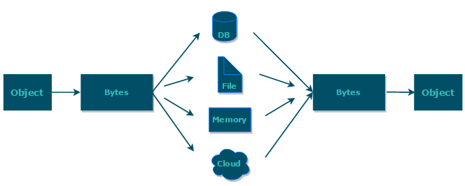

## java 序列化
### 什么是序列化：
    将数据结构或对象转换成二进制字节流的过程
### 什么是反序列化：
    将在序列化过程中所生成的二进制字节流转换成数据结构或对象的过程

对于java这种面向对象编程语言来说，我们序列化的都是对象，也就是实例化后的类，但是在c++这种半面向对象的语言中，struct定义的是数据结构类型，而class对应的是对象类型。

### 维基百科是如何介绍序列化的：
    序列化（serialization）在计算机科学的数据处理中，是指将数据结构或对象状态转换成可取用格式（例如存成文件，存于缓冲，或经由网络中发送），
    以留待后续在相同或另一台计算机环境中，能恢复原先状态的过程。依照序列化格式重新获取字节的结果时，可以利用它来生产与原始对象相同语义的副本。
    对于许多对象，像是使用大量引用的复杂对象，这种序列化重建的过程并不容易。面向对象中的对象序列化，并不概括之前原始对象所关系的函数。这种过程
    也称为对象编组。从一系列字节提取数据结构的反向操作，是反序列化（也称解编组）

综上：序列化的主要目的是通过网络传输对象或者说是将对象存储到文件系统、数据库、内存中。



### 实际开发中有哪些用到序列化和反序列化的场景？
1. 对象在进行网络传输（比如远程方法调用RPC的时候）之前需要先被序列化，接收到序列化的对象之后需要再进行反序列化；
2. 将对象存储到文件中的时候需要进行序列化，将对象从文件中读取出来需要进行反序列化。
3. 将对象存储到缓存数据库（如 redis）时需要用到序列化，将对象从缓存数据库中读取出来需要反序列化。

### 常见序列化协议对比
jdk自带的序列化方式一般不会用，因为序列化效率低而且部分版本有安全漏洞。比较常用的序列化协议有 hessian、kyro、protostuff。


下面提到的都是基于二进制的序列化协议，像JSON和XMl这种属于文本类序列化方式，虽然JOSN和XML可读性比较好，但性能较差，一般不会选择。

#### JDK自带的序列化方式
JDk自带的序列化，只需实现 `` java.io.Serializable``接口即可
```
@AllArgsConstructor
@NoArgsConstructor
@Getter
@Builder
@ToString
public class RpcRequest implements Serializable {
    private static final long serialVersionUID = 1905122041950251207L;
    private String requestId;
    private String interfaceName;
    private String methodName;
    private Object[] parameters;
    private Class<?>[] paramTypes;
    private RpcMessageTypeEnum rpcMessageTypeEnum;
}
```

    序列化好serialVersionUID属于版本控制的作用，序列化的时候serialVersionUID也会被写入二进制序列，
    当反序列化时候会检查serialVersionUID是否和当前类的serialVersionUID一致，如果serialVersionUID不一致则会抛出InvalidClassExcetion异常，
    强烈推荐每个序列化类都手动指定其serialVersionUID，如果不手动指定，那么编译器会动态生成默认的序列化号